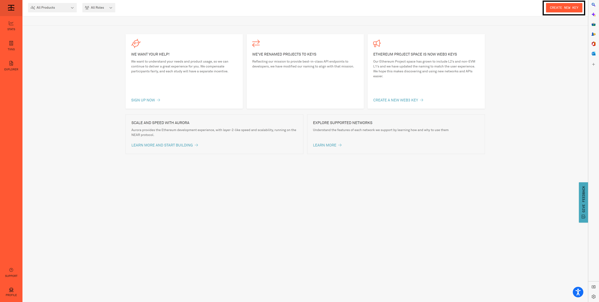
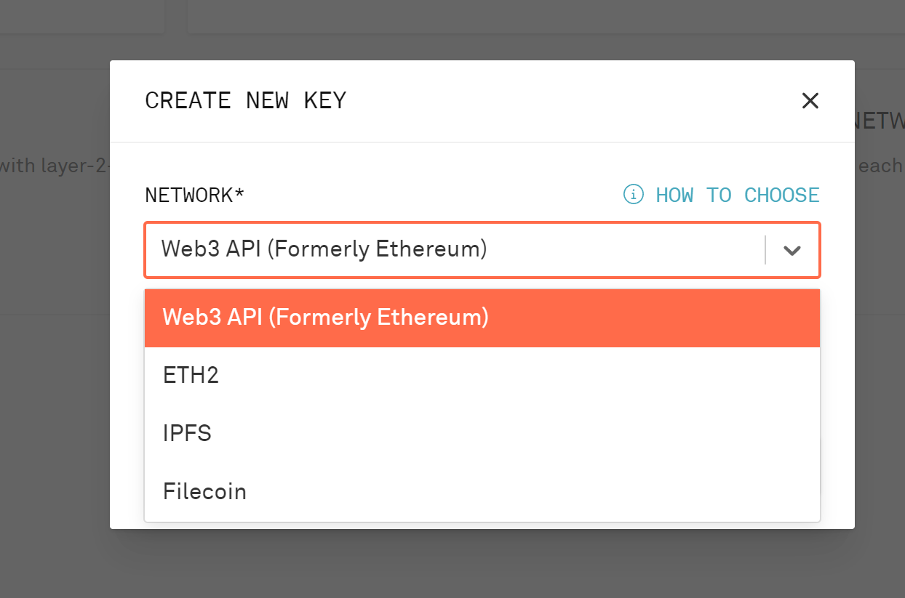
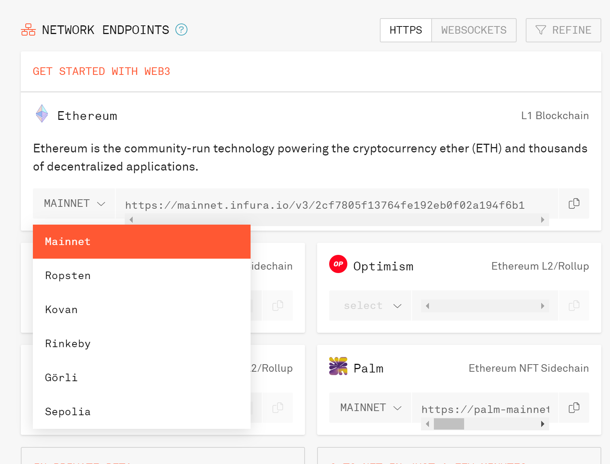
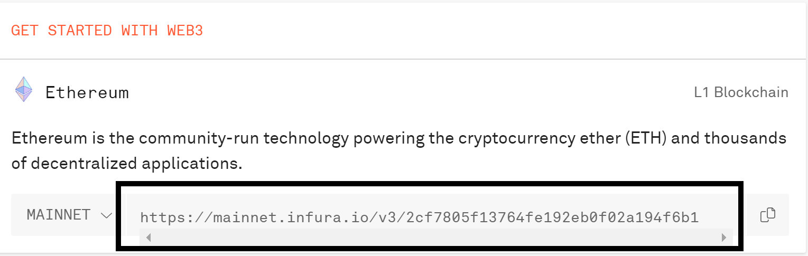

# Infura Tutorial

1. Register the [infura account](https://infura.io/register)

2. Login to [Infura](https://infura.io/login)

3. Click CREATE NEW KEY on the top right. 
   

4. select web 3 API and give it a name, then click CREATE.
   

6. Choose Rinkey in ENDPOINTS MENU by clicking on the dropdown for ETHEREUM. 

8. Copy the URL and paste to `nodeURL` columns which in the configuration file noted before. (../src/main/resources/sample.properties)
   
